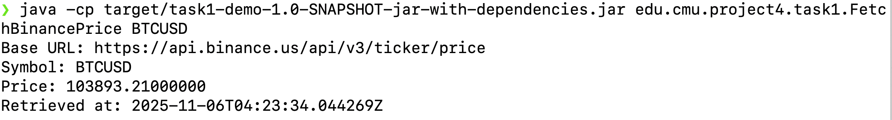
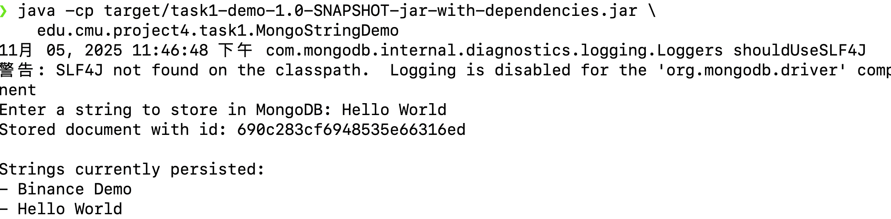
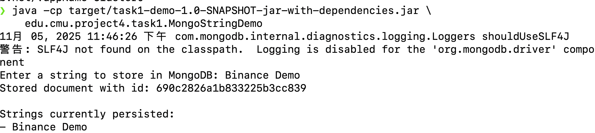

# Project 4 – Task 1

- Name: Siyuan Liu
- Andrew ID: sliu5

## Selected API
- API Name: Binance Spot Price API
- Documentation URL: https://binance-docs.github.io/apidocs/spot/en/#symbol-price-ticker
- Notes: The Binance public ticker endpoint returns real-time price data as JSON and does not require authentication for basic queries.

## Mobile Application Concept
The mobile app lets users monitor major cryptocurrency price, showing 24-hour change from Binance. Users can configure price alerts so the app notifies them when a threshold is crossed.

## Console Screenshots
### 1. Binance Price Fetch Demo

### 2. MongoDB Atlas Read/Write Demo

## Execution Summary
- `FetchBinancePrice`: Run with `BINANCE_API_BASE=https://api.binance.us/api/v3/ticker/price` to fetch pair `BTCUSD`, printing the price and timestamp.
- `MongoStringDemo`: Connects to Atlas using `MONGODB_URI`, prompts for a string, writes it to the collection `project4.task1Strings`, and prints all stored strings.
